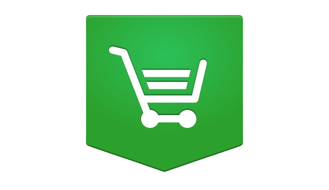

# ShopSphere

### 1. Clone the Repository

```bash
# Clone the repository
$ git clone https://github.com/rohithr018/ShopSphere.git

# Navigate to the project directory
$ cd rohithr018-ShopSphere
```

### 2. Install Dependencies

#### Backend (ECOMMERCEAPI):
```bash
$ cd ECOMMERCEAPI
$ npm install
```

#### Admin Dashboard:
```bash
$ cd ../admin
$ npm install
```

#### Frontend:
```bash
$ cd ../src
$ npm install
```

### 3. Configure Environment Variables

Create `.env` files in the appropriate directories to set up environment variables:

#### Backend (ECOMMERCEAPI/.env):
```env
MONGO_URI=<your_mongo_db_uri>
JWT_SECRET=<your_jwt_secret>
STRIPE_KEY=<your_stripe_api_key>
PORT=8000
```

#### Admin Dashboard (admin/.env):
```env
REACT_APP_API_URL=http://localhost:8000/api
```

#### Frontend (src/.env):
```env
REACT_APP_API_URL=http://localhost:8000/api
```

### 4. Run the Application

#### Backend:
```bash
$ cd ECOMMERCEAPI
$ npm start
```

#### Admin Dashboard:
```bash
$ cd ../admin
$ npm start
```

#### Frontend:
```bash
$ cd ../src
$ npm start
```

## Usage

- Visit the frontend at `http://localhost:3000`.
- Access the admin dashboard at `http://localhost:3001`.
- The backend API runs at `http://localhost:8000`.
